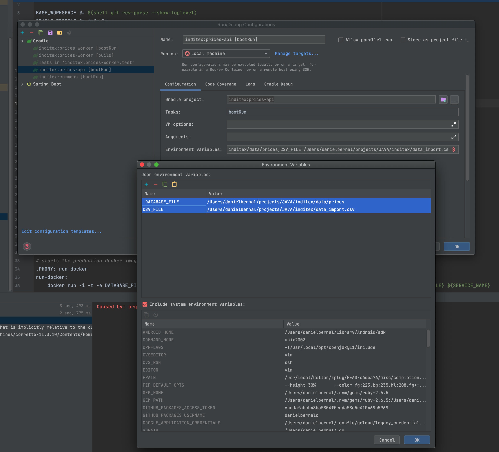

## Demo inditex

En la base de datos de comercio electrónico de la compañía disponemos de la tabla PRICES que refleja el precio final (
pvp) y la tarifa que aplica a un producto de una cadena entre unas fechas determinadas. A continuación se muestra un
ejemplo de la tabla con los campos relevantes:

### PRICES

|BRAND_ID|START_DATE |END_DATE|PRICE_LIST|PRODUCT_ID|PRIORITY|PRICE|CURR|
|--------|-------------|--------|----------|----------|--------|-----|-----|
|1|2020-06-14-00.00.00|2020-12-31-23.59.59|1|35455|0|35.50|EUR|
|1|2020-06-14-15.00.00|2020-06-14-18.30.00|2|35455|1|25.45|EUR|
|1|2020-06-15-00.00.00|2020-06-15-11.00.00|3|35455|1|30.50|EUR|
|1|2020-06-15-16.00.00|2020-12-31-23.59.59|4|35455 |1|38.95|EUR|

#### Campos:

`BRAND_ID`: foreign key de la cadena del grupo (1 = ZARA).

`START_DATE` , `END_DATE`: rango de fechas en el que aplica el precio tarifa indicado.

`PRICE_LIST`: Identificador de la tarifa de precios aplicable.

`PRODUCT_ID`: Identificador código de producto.

`PRIORITY`: Desambiguador de aplicación de precios. Si dos tarifas coinciden en un rago de fechas se aplica la de mayor
prioridad (mayor valor numérico).

`PRICE`: precio final de venta.

`CURR`: iso de la moneda.

### Se pide:

- Construir una aplicación/servicio en SpringBoot que provea una end point rest de consulta tal que:
    - Acepte como parámetros de entrada: fecha de aplicación, identificador de producto, identificador de cadena.
    - Devuelva como datos de salida: identificador de producto, identificador de cadena, tarifa a aplicar, fechas de
      aplicación y precio final a aplicar.


- Se debe utilizar una base de datos en memoria (tipo h2) e inicializar con los datos del ejemplo, (se pueden cambiar el
  nombre de los campos y añadir otros nuevos si se quiere, elegir el tipo de dato que se considere adecuado para los
  mismos).


- Desarrollar unos test al endpoint rest que validen las siguientes peticiones al servicio con los datos del ejemplo:
    - Test 1: petición a las 10:00 del día 14 del producto 35455 para la brand 1 (ZARA)
    - Test 2: petición a las 16:00 del día 14 del producto 35455 para la brand 1 (ZARA)
    - Test 3: petición a las 21:00 del día 14 del producto 35455 para la brand 1 (ZARA)
    - Test 4: petición a las 10:00 del día 15 del producto 35455 para la brand 1 (ZARA)
    - Test 5: petición a las 21:00 del día 16 del producto 35455 para la brand 1 (ZARA)


- Los datos de los precios se cargan en la base de datos a partir de un fichero CSV (ver el fichero adjunto para un
  ejemplo) que se actualiza periódicamente y se guarda en el servidor. Desarrolla el proceso de la carga que se tiene
  que ejecutar cada 24 horas. El fichero adjunto se puede utilizar en los tests.

## Requisitos

    Java JDK 11
    Gradle 6

## Descripcion

    El ejercicio consta de tres modulos de gralde, que son necesarios para separar responsabilidades de cada uno

- commons
- prices-api
- prices-worker

## module: `commons`

Es un Libreria, sirve para conectar a la base de datos, expone una interfaz `PriceService` para ser consumida desde afuera.

## module `prices-api`

Es un servicio REST, que expone un endpoint `/price` para consultar segun la fecha el mejor precio de un producto

      Resource [GET] /price
      
      Params: 
        * current_date: fecha en la que desea consultar.
        * brand:  id de la marca en la que queremos consultar.
        * product: id del producto que queremos consultar.
      
      Response: 
         
         {
           "productID": 35455,
           "brandID": 1,
           "priceList": 1,
           "startDate": "2020-06-14-00.00.00",
           "endDate": "2020-12-31-23.59.59",
           "price": 35.5
         }
         
      Ejemplo:
      [GET] /price?current_date=2020-06-14-10.00.00&brand=1&product=35455

## module `prices-worker`

Es un worker que tiene como unico parametro de entrada el filepath donde cargar el archivo CSV.

Ejemplo: java -jar prices-worker-0.0.1-SNAPSHOT.jar data_import.csv


## Ejecutar micros por consola 

Para correr en console, he creado un Makefile para cada modulo, se puede ejecutar de la sigueinte manera: 

Con entrar en la carpeta de los dos modulos api y worker, puede correr: 
  
```
  cd prices-worker o cd prices-api
  ```
En el archivo `Makefile` estan seteadas, las funciones y variables de entornos necesarias para correr los micros. 

run: utilizando bootRun de gradle
```bash
    make run
```
  test:
```bash
    make test
```

build: utilizando build de gradle
```bash
    make build
```

build-docker: build de imagen de docker, para esta es necesario correr `make build` previamente.
```bash
    make build-docker
```
run-docker: run imagen de docker, ejecutar servicio en un contenedor.
```bash
    make run-docker
```

# Observaciones

* Los test de integracion en prices-api, son los pedidos en el ejercicio:
  
    * Test 1: petición a las 10:00 del día 14 del producto 35455 para la brand 1 (ZARA)
    * Test 2: petición a las 16:00 del día 14 del producto 35455 para la brand 1 (ZARA)
    * Test 3: petición a las 21:00 del día 14 del producto 35455 para la brand 1 (ZARA)
    * Test 4: petición a las 10:00 del día 15 del producto 35455 para la brand 1 (ZARA)
    * Test 5: petición a las 21:00 del día 16 del producto 35455 para la brand 1 (ZARA)
  

* Para correr el worker de manera programada, se toma en cuanta lo siguiente
  * Si utiliza kubernetes en un cloud (aws/google/azure) con crear un cronjob es suficiente
  * Si utiliza una instancia normal con configurar el cron de unix y ejecutar el jar es suficiente.


* Tanto para el worker como la api se genero un Dockerfile.prod, para ser utilizado en cualquier cloud.


* Se genera un Makefile para ser ejecutado desde cualquier integracion continua (CI), como por ejemplo jenkins, gitlab-ci, github actions, entre otros.
 
* Si desea ejecutar las tareas desde un IDE por ejemplo Intelijj, debera configurar dos variables de entorno para cada uno de los proyectos:
```
$ DATABASE_FILE=/home/prices # necesario para todos los micros.
$ CSV_FILE=/home/data_import.csv #este es solo necesario para el worker.
```

